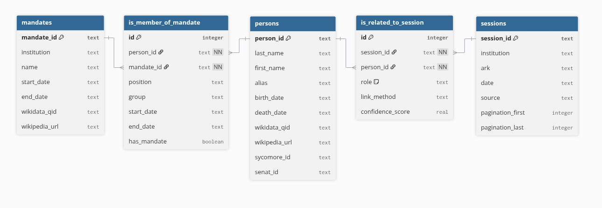

# decidon_prosopography.db

## Overview
This SQLite database stores prosopographical data about senators, deputies, and ministers under the French Third Republic (1870–1940). It supports named entity linking for mentions extracted from the official report of parliamentary debates (*Journal officiel*).

## Schema

### Table `persons`
This table stores senators, deputies, and ministers, and may be expanded to include other prominent figures who appeared in parliamentary debates.

| Field | Type | Description                                                                            |
|---|---|----------------------------------------------------------------------------------------|
| `person_id` | `TEXT` | Primary key.                                                                           |
| `last_name` | `TEXT` | Family name.                                                                           |
| `first_name` | `TEXT` | Given name.                                                                            |
| `alias` | `TEXT` | Alternative name.                                                                      |
| `birth_date` | `TEXT` | Date of birth.                                                                         |
| `death_date` | `TEXT` | Date of death.                                                                         |
| `wikidata_qid` | `TEXT` | Wikidata identifier: https://www.wikidata.org/wiki/{wikidata_qid}.                                                                 |
| `wikipedia_url` | `TEXT` | Wikipedia URL.                                                                         |
| `sycomore_id` | `TEXT` | Sycomore identifier: https://www2.assemblee-nationale.fr/sycomore/fiche/{sycomore_id}. |
| `senat_id` | `TEXT` | Sénat identifier: https://www.senat.fr/senateur-3eme-republique/{senat_id}.html.       |

### Table `mandates`
This table stores mandate periods for the government, Senate, and Chamber.

| Field | Type | Description                                                              |
|---|---|--------------------------------------------------------------------------|
| `mandate_id` | `TEXT` | Primary key.                                                             |
| `institution` | `TEXT` | Institution name (`gouvernement`, `senat`, or `chambre`).                |
| `name` | `TEXT` | Mandate label, for example `Gouvernement Gambetta` or `Ire législature`. |
| `start_date` | `TEXT` | Start date.                                                              |
| `end_date` | `TEXT` | End date.                                                                |
| `wikidata_qid` | `TEXT` | Wikidata identifier.                                                     |
| `wikipedia_url` | `TEXT` | Wikipedia URL.                                                           |

### Table `is_member_of_mandate`
This table links persons to mandates and stores metadata about their position and/or role held during the mandate.

| Field | Type | Description                                                                         |
|---|---|-------------------------------------------------------------------------------------|
| `id` | `INTEGER` | Primary key.                                                                        |
| `person_id` | `TEXT` | FK to `persons`.                                                                    |
| `mandate_id` | `TEXT` | FK to `mandates`.                                                                   |
| `position` | `TEXT` | Office.                                                                             |
| `role` | `TEXT` | Role within the mandate or debate context (for example, president or spokesperson). |
| `group` | `TEXT` | Political group.                                                                    |
| `start_date` | `TEXT` | Start date.                                                                         |
| `end_date` | `TEXT` | End date.                                                                           |

Note: For ministers, we did not have access to the exact start and end dates of their membership within a mandate; therefore, these dates were defaulted to the mandate's start and end dates.

### Table `sessions`
This table stores all parliamentary debate sessions from 1881 to 1940.

| Field | Type | Description |
|---|---|---|
| `session_id` | `TEXT` | Primary key. |
| `institution` | `TEXT` | Institution. |
| `ark` | `TEXT` | ARK identifier. |
| `date` | `TEXT` | Session date. |
| `source` | `TEXT` | Source. |
| `pagination_first` | `INTEGER` | First page. |
| `pagination_last` | `INTEGER` | Last page. |

### Table `is_related_to_session`
This table links persons to sessions and stores some metadata.

| Field | Type | Description |
|---|---|---|
| `id` | `INTEGER` | Primary key. |
| `session_id` | `TEXT` | FK to `sessions`. |
| `person_id` | `TEXT` | FK to `persons`. |
| `role` | `TEXT` | `SPK` if speaker; `PER` if person mention. |
| `link_method` | `TEXT` | `manual` or `automatic`. |
| `confidence_score` | `REAL` | Linking confidence score. |

## Sources
- Ministers: https://fr.wikipedia.org/wiki/Liste_des_gouvernements_de_la_France
- Deputies: https://www2.assemblee-nationale.fr/sycomore/liste/{i} for i in range(26, 43)
- Senators: https://www.senat.fr/senateurs-3eme-republique/senatl.html